# Note.js with express generator

## Why express generator?

1. 透過 generator，快速產生 express 專案，**不在需要手動新增基本的檔案**

## How to start?

1. 下載 express-generator：`sudo npm i express-generator -g`
    - `sudo`：使用管理員權限執行
    - `-g`：全專案環境皆可使用

2. 開新專案：`express --view=pug "APP-NAME"`

3. 進入專案資料夾路徑：`cd "APP-NAME"`

4. 下載相關套件：`npm install`

5. 將 package.json 中的指令改成 `nodemon`

6. 運行專案：`npm start`

---

## Project Files

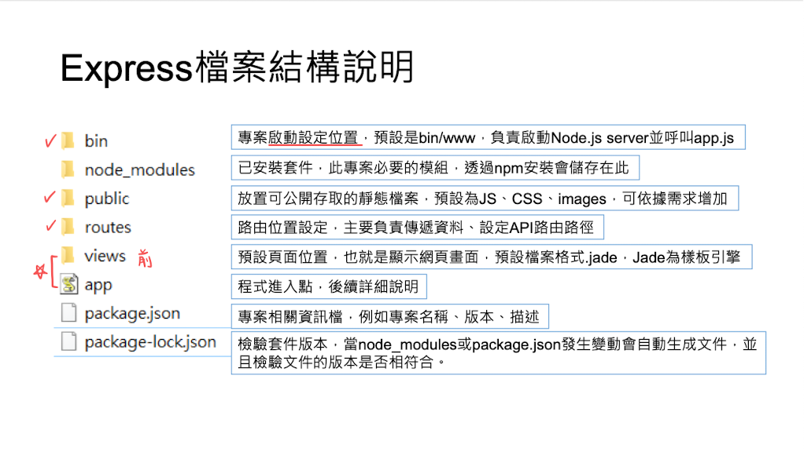

## Package.json

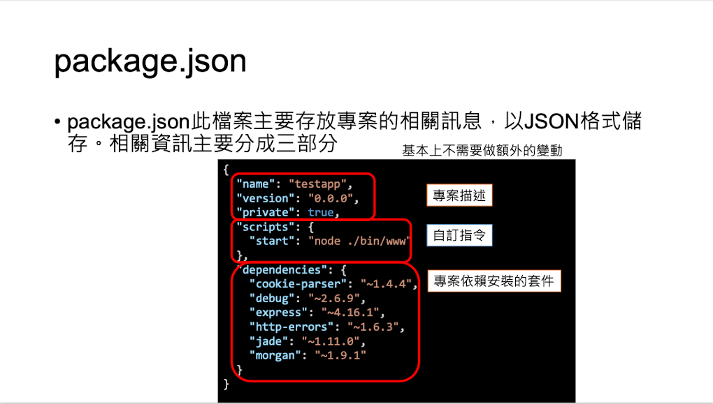

## Dependencies

1. 解除安裝：`npm uninstall express PACKAGE_NAME`

2. 自動紀錄新增安裝套件名稱：安裝過程中加 `--save` 會自動加入 dependency 中

## App.js

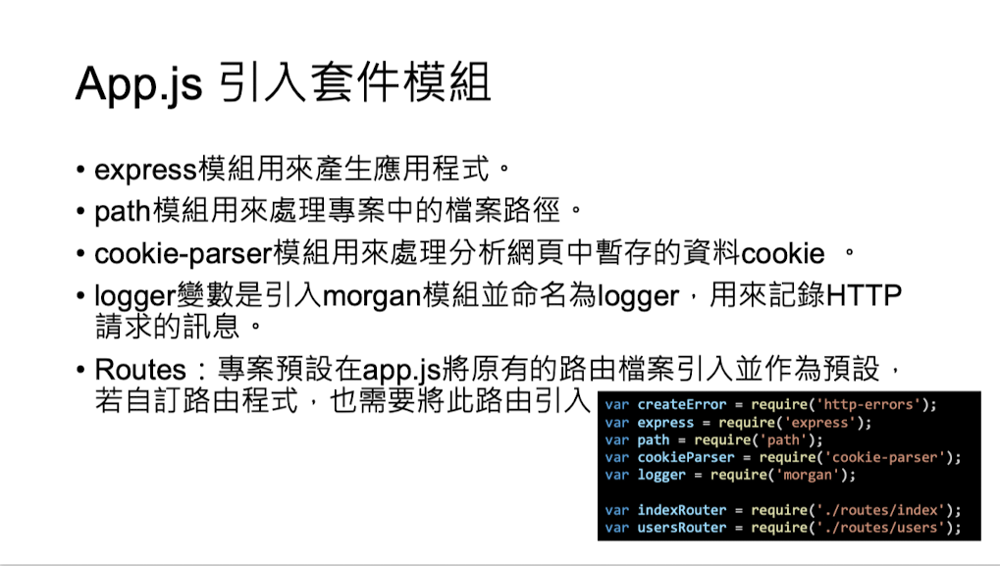

## Modules

### 定義

1. 建立 modules 資料夾 (避免與原先 node_module 混淆)

2. 在 modules 資料夾自訂模組 `test.js`（參考 modules 資料夾的 test.js）

    - Note: 不管是路由或 app.js，最後一行都是用模組方式輸出，讓其他程式可以使用

### 使用

參考 routes > modules.js

引入模組：`let test = require("../modules/test");`

使用模組方法：`test.METHOD(parm1, parm2);`

---

## Request method

||GET|POST|
|:-:|:-:|:-:|
|Header|V|V|
|Body|X|V|
|Note||機密資訊會放 body|

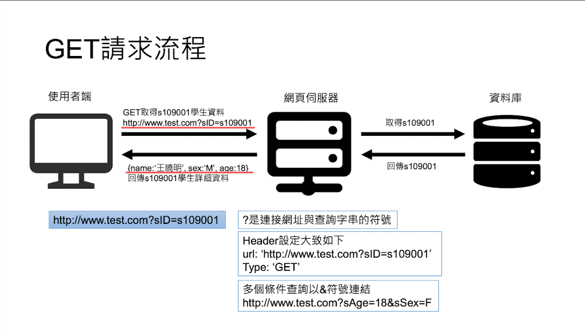

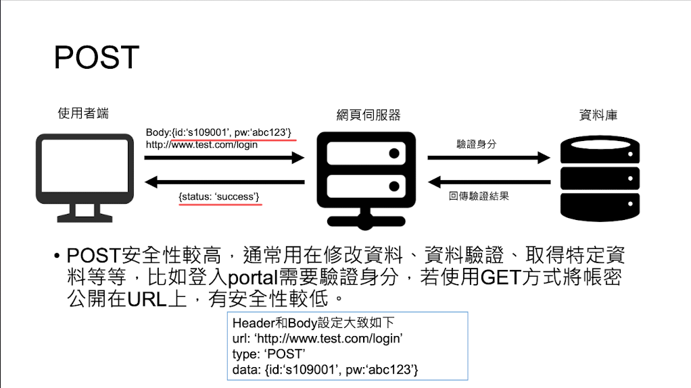

參考 routes > route.js

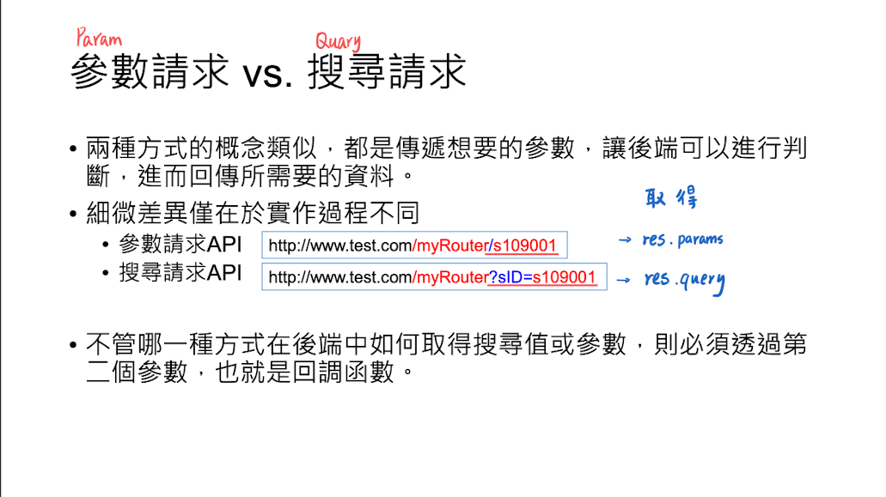

### Callback function 回調函數

分為 req 請求，res 回覆

- req:

  - req.body: 取得 POST 中 Body 內容
  

  - req.query: 取得 GET / POST 請求的查詢內容
  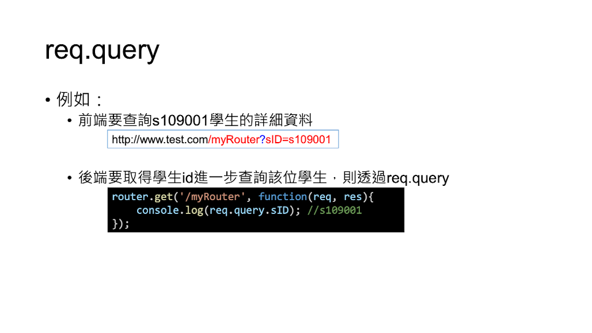

  - req.params: 取得 GET / POST 請求中，API 帶入參數
  注：params 請求路徑應為 `路徑/router:param_name`
  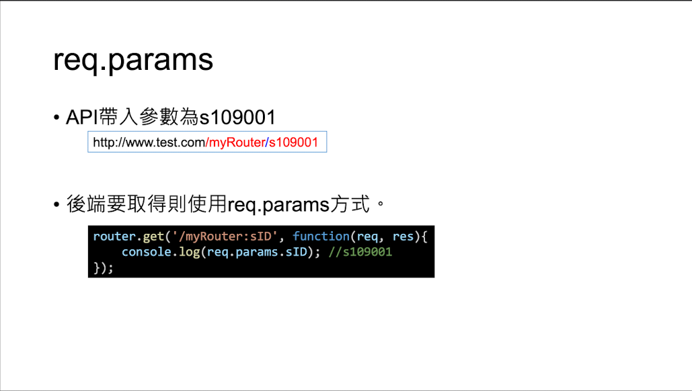

- res:
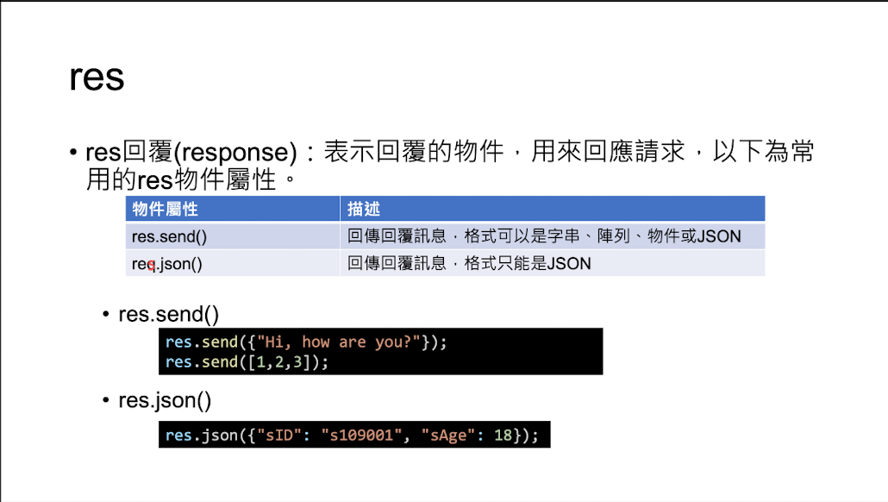

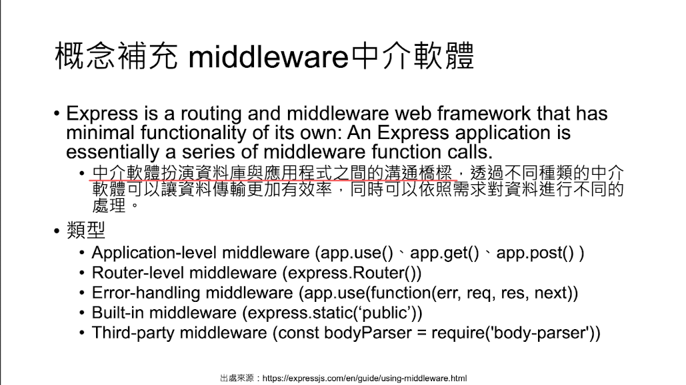

---

## Ajax 非同步請求

不刷新頁面的方式更新頁面資料

### 一般語法

```JavaScript
$.ajax(
    url: "API",
    contentType: "application/x-www-form-urlencoded",
    data: "DATA",
    type: "POST",
    datatype: "後端回傳的資料型態" 
    success: function(res) {

    },
    error: function(){

    }
)
```

- 傳入：一個物件，包含許多屬性與方法

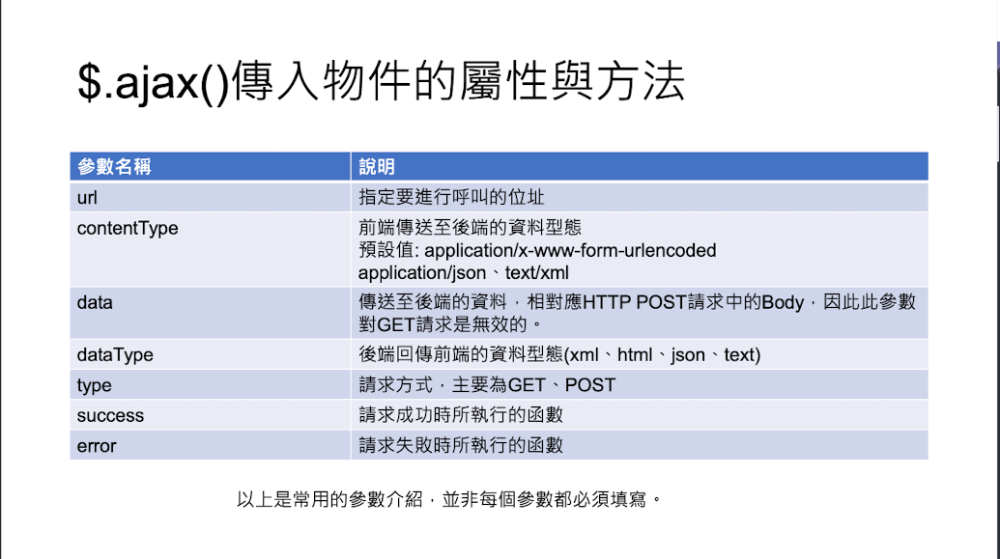

### 簡易語法

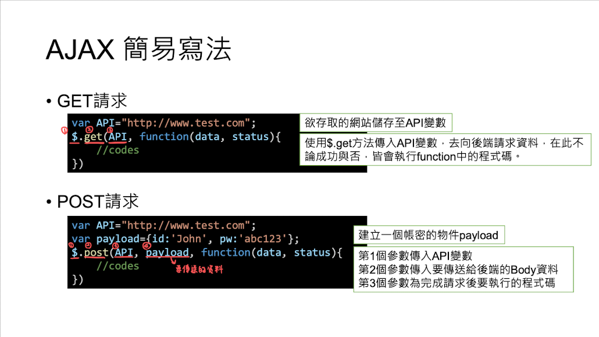
